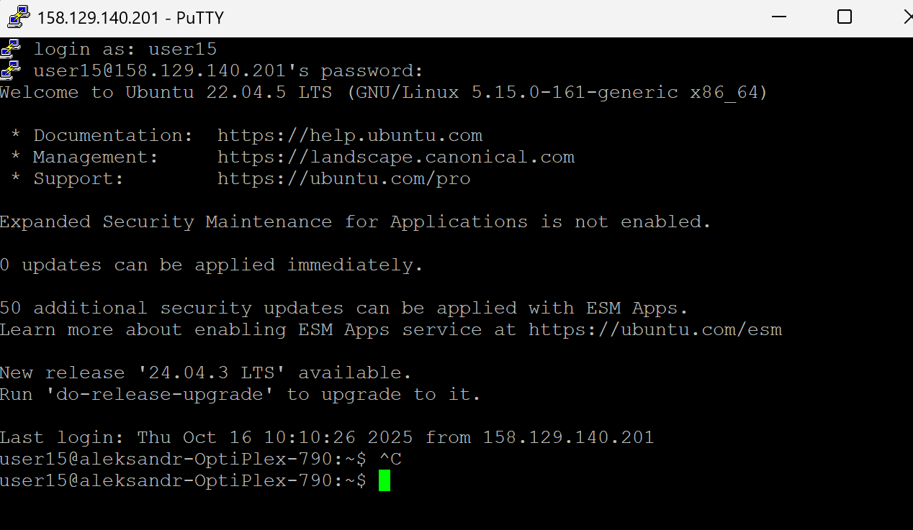

# 3-oji (papildoma) užduotis: Bitcoin transakcijų ir blokų analizė su `Libbitcoin` ir `python-bitcoinlib`

WSL2 yra daug lėtesnis nei realus Linux, todėl visi instaliavimai vyko labaaai ilgai.

---

## 1 DALIS: Merkle medžio implementacija su Libbitcoin 

<details>
 <summary><strong>1.1 Libbitcoin-System įdiegimas</strong></summary>

### Žingsnis 1: Bandymas Windows aplinkoje (NEPAVYKO)

Pirma bandžiau įdiegti Windows 11 su Visual Studio 2022.

Bandžiau per:
- NuGet paketų valdymą
- vcpkg paketų sistemą

**Rezultatas:**

```bash
# NuGet paieška
> Install-Package libbitcoin-system
Error: No packages found

# vcpkg bandymas
> vcpkg install libbitcoin-system:x64-windows
Error: libbitcoin-system does not exist
```

**Kas nutiko:** libbitcoin daugiau nepalaiko Windows. Visi paketai pašalinti iš NuGet ir vcpkg.

**Ką padariau:** Persijungiau į Linux per WSL2.


### Žingsnis 2: WSL2 Ubuntu paruošimas (PAVYKO)

Reikėjo paruošti Linux aplinką kad galėčiau viską sukompiliuoti.

**Veiksmai:**

```bash
# Įdiegiau Ubuntu 24.04 LTS per WSL2
wsl --install -d Ubuntu-24.04

# Atnaujinau sistemą
sudo apt update
sudo apt upgrade -y
```

**Rezultatas:** [PAVYKO] Sistema paruošta, galiu pradėti diegimą.


### Žingsnis 3: Automatinis diegimas su `install.sh` (NEPAVYKO)

Norėjau paleisti oficialų diegimo skriptą, kad viskas įsidiegtų automatiškai.

**Komanda:**

```bash
sudo ./install.sh --build-boost --build-secp256k1
```

**Procesas:**
1. [PAVYKO] Boost 1.86 kompiliaciją pradėjau ir sėkmingai užbaigiau
2. [NEPAVYKO] secp256k1 klonavimas iš GitHub nepavyko:

```
Cloning https://github.com/bitcoin-core/secp256k1.git...
fatal: unable to access 'https://github.com/bitcoin-core/secp256k1.git/': 
       The requested URL returned error: 500 Internal Server Error
```

**Kas nutiko:** GitHub grąžino klaidą (HTTP 500) keletą kartų iš eilės. Automatinis atsisiuntimas neveikė.

**Ką padariau:** Nusprendžiau atsisiųsti ir įdiegti secp256k1 rankiniu būdu.


### Žingsnis 4: Rankinis secp256k1 diegimas (PAVYKO)

Norint apeiti GitHub problemą, atsisiųsiau ZIP failą ir įdiegiau rankiniu būdu.

**Veiksmai:**

```bash
# Atsisiųsti kodą rankiniu būdu
wget https://github.com/bitcoin-core/secp256k1/archive/refs/heads/master.zip
unzip master.zip
cd secp256k1-master

# Kompiliuoti ir įdiegti
./autogen.sh
./configure --enable-module-recovery
make
sudo make install
sudo ldconfig
```

**Rezultatas:** [PAVYKO] secp256k1 biblioteką įdiegiau į `/home/neda/local/lib/libsecp256k1.so`


### Žingsnis 5: Boost kompiliacija su visais gijomis (NEPAVYKO)

Bandžiau sukompiliuoti Boost su įprastais nustatymais.

**Komanda:**

```bash
sudo ./install.sh --build-boost
```

**Procesas:**
- Boost 1.86 kompiliacija pradėta su visomis gijomis (`-j$(nproc)`)
- Kompiliacija progresavo iki ~40%

**Gedimas:**

```
g++: internal compiler error: Killed (program cc1plus)
[Terminated]
```

Terminal užsidarė, WSL procesai sustabdyti.

**Kas nutiko:** 
- `dmesg` parodė: `Out of memory: Killed process`
- WSL2 turi tik 8GB RAM, o Boost kompiliacijai reikia ~12GB

**Ką supratau:** Reikia pridėti swap atmintį (virtualią atmintį).


### Žingsnis 6: 8GB Swap failo sukūrimas (PAVYKO)

Pridėjau 8GB virtualios atminties (swap), kad WSL2 turėtų pakankamai RAM.

**Veiksmai:**

```bash
# Sukurti 8GB swap failą
sudo fallocate -l 8G /swapfile

# Nustatyti leidimus (tik root)
sudo chmod 600 /swapfile

# Inicializuoti swap
sudo mkswap /swapfile

# Aktyvuoti swap
sudo swapon /swapfile

# Patikrinti
free -h
#              total        used        free      shared  buff/cache   available
# Mem:          7.7Gi       2.1Gi       4.2Gi       0.1Gi       1.4Gi       5.3Gi
# Swap:         8.0Gi          0B       8.0Gi
```

**Rezultatas:** [PAVYKO] WSL2 dabar turi 8GB + 8GB = 16GB bendrą atmintį.


### Žingsnis 7: Boost perkompiliavimas su mažiau gijų (PAVYKO)

Bandžiau dar kartą, bet šį kartą sumažinau paralelių procesų skaičių, kad RAM naudojimas būtų mažesnis.

**Komanda:**

```bash
PARALLEL=4 PREFIX=$HOME/local ./install.sh --build-boost
```

**Kaip vyko:**
- Boost kompiliacija su tik 4 gijomis (vietoj 24)
- Užtruko ilgiau (~20 min), bet atmintis naudojosi stabiliai
- Kompiliacija užsibaigė be crash'ų

**Rezultatas:**
```
Building libbitcoin-system...
[100%] Built target bitcoin-system
Running tests...
Test project /home/user/libbitcoin-system/build
      Start  1: blockchain_tests
      ...
      Start 4064: version_tests
100% tests passed, 0 tests failed out of 4064
```

**[PAVYKO] Visos 4064 testai praėjo sėkmingai!**


### Žingsnis 8: Diegimas į sistemą su sudo (PAVYKO)

Dabar reikėjo įdiegti sukompiliuotas bibliotekas į sistemą (`/usr/local/`).

**Problema:**

```bash
make install
# Error: Permission denied — cannot write to /home/neda/local/lib/
```

**Sprendimas:**

```bash
cd build-libbitcoin-system/libbitcoin-system
sudo make install
```

**Rezultatas:** [PAVYKO] Bibliotekas įdiegiau:
- `/home/neda/local/lib/libbitcoin-system.so`
- `/home/neda/local/include/bitcoin/system/`
- `/home/neda/local/lib/pkgconfig/libbitcoin-system.pc`


### Žingsnis 9: Patikrinimas (VEIKIA)

Į Ubuntu terminalą įvedžiau:
`pkg-config --cflags --libs libbitcoin-system`

Gavau:
`home/neda/local/include -L/usr/local/lib -lbitcoin-system -L/home/neda/local/lib -lboost_iostreams -lboost_locale -lboost_program_options -lboost_thread -lboost_url -lpthread -lrt -ldl -lsecp256k1`

Išvada: `libbitcoin-system` biblioteka instaliuot sėkmingai.

</details>


<details>
 <summary><strong>1.2 Užduoty pateiktos create_merkle() funkcijos analizė</strong></summary>

`create_merkle()` funkcija realizuoja Merkle tree konstrukciją pagal Bitcoin protokolo specifikaciją. Funkcija priima transakcijų hash'ų sąrašą (`bc::hash_list`) ir grąžina vieną hash'ą – Merkle root, naudojamą bloko header'yje.

#### Funkcijos kodas:

```cpp
//merkle.cpp
#include <bitcoin/bitcoin.hpp>

// Merkle Root Hash
bc::hash_digest create_merkle(bc::hash_list& merkle) {
    // Stop if hash list is empty or contains one element
    if (merkle.empty())
        return bc::null_hash;
    else if (merkle.size() == 1)
        return merkle[0];

    // While there is more than 1 hash in the list, keep looping...
    while (merkle.size() > 1)
    {
        // If number of hashes is odd, duplicate last hash in the list.
        if (merkle.size() % 2 != 0)
            merkle.push_back(merkle.back());
        // List size is now even.
        assert(merkle.size() % 2 == 0);

        // New hash list.
        bc::hash_list new_merkle;
        // Loop through hashes 2 at a time.
        for (auto it = merkle.begin(); it != merkle.end(); it += 2)
        {
            // Join both current hashes together (concatenate).
            bc::data_chunk concat_data(bc::hash_size * 2);
            auto concat = bc::serializer<
                decltype(concat_data.begin())>(concat_data.begin());
            concat.write_hash(*it);
            concat.write_hash(*(it + 1));
            // Hash both of the hashes.
            bc::hash_digest new_root = bc::bitcoin_hash(concat_data);
            // Add this to the new list.
            new_merkle.push_back(new_root);
        }
        // This is the new list.
        merkle = new_merkle;

        // DEBUG output
        std::cout << "Current merkle hash list:" << std::endl;
        for (const auto& hash: merkle)
            std::cout << "  " << bc::encode_base16(hash) << std::endl;
        std::cout << std::endl;
    }

    // Finally we end up with a single item.
    return merkle[0];
}
```

#### 1. Edge-case apdorojimas

```cpp
if (merkle.empty())
    return bc::null_hash;
else if (merkle.size() == 1)
    return merkle[0];
```

- **Jei sąrašas tuščias:** grąžinamas `null_hash` (nulinis hash'as)
- **Jei jame tik vienas hash'as:** jis jau yra galutinis Merkle root
- **Paskirtis:** apsauga nuo neteisingo įvesties dydžio ir taisyklingo apdorojimo užtikrinimas

#### 2. Nelyginio hash'ų skaičiaus tvarkymas

```cpp
if (merkle.size() % 2 != 0)
    merkle.push_back(merkle.back());
```

- **Bitcoin taisyklė:** jeigu kuriame Merkle lygmenyje hash'ų skaičius nelyginis, paskutinis hash'as duplikuojamas, kad būtų galima sudaryti pilnas poras
- **Pavyzdys:** `[A, B, C]` → `[A, B, C, C]`
- **Kodėl svarbu:** tai užtikrina deterministinį, nuoseklų Merkle medžio kūrimą, kuris visada duoda tą patį rezultatą su tais pačiais hash'ais

#### 3. Hash'ų porų sujungimas ir dvigubas hash'inimas

```cpp
for (auto it = merkle.begin(); it != merkle.end(); it += 2)
{
    // Sujungiami (concatenate) du hash'ai
    concat.write_hash(*it);
    concat.write_hash(*(it + 1));
    
    // Hash'inami dvigubu SHA-256 (bitcoin_hash)
    bc::hash_digest new_root = bc::bitcoin_hash(concat_data);
    
    // Rezultatas įdedamas į naują sąrašą
    new_merkle.push_back(new_root);
}
```

Kiekvienoje iteracijoje hash'ai apdorojami poromis (`it += 2`):

1. **Sujungiami du hash'ai:** kiekviena pora konkatenojama į vieną duomenų bloką
2. **Taikomas dvigubas SHA-256:** naudojama `bitcoin_hash()` funkcija (SHA-256 du kartus)
3. **Rezultatas įrašomas:** naujas hash'as pridedamas į kito lygmens sąrašą

Tokiu būdu sukuriamas kitas Merkle tree lygmuo.

#### 4. Iteratyvus Merkle lygmenų konstravimas

```cpp
merkle = new_merkle;
```

- Naujai sudarytas hash'ų lygmuo tampa įvestimi kitai iteracijai
- Ciklas kartojamas tol, kol lieka tik vienas elementas
- Kiekviena iteracija sukuria naują Merkle medžio lygmenį, judant nuo lapų link šaknies

#### 5. Galutinio rezultato grąžinimas

```cpp
return merkle[0];
```

Kai sąraše yra vienas hash'as, jis yra **Merkle root** – galutinis rezultatas, naudojamas bloko antraštėje.

#### Algoritmo vizualizacija:

```

┌───┐     ┌───┐                ┌───┐        ┌───┐
│ A │     │ B │                │ C │        │ D │
└───┘     └───┘                └───┘        └───┘
tx0       tx1                  tx2          tx3
 │           │                      │           │
 └─────┬─────┘                      └─────┬─────┘
       │                                  │
       ▼                                  ▼
┌──────────────┐                 ┌──────────────┐
│ hash(AB)     │                 │ hash(CD)     │
└──────────────┘                 └──────────────┘
      │                                  │
      └────────────────┬─────────────────┘
                       │
                       ▼
           ┌───────────────────────────────┐
           │         Merkle Root           │
           │     hash(ABCD_level_2)        │
           └───────────────────────────────┘
```

#### Išvados:

- Funkcija tiksliai atitinka Bitcoin Merkle medžio specifikaciją
- Naudoja dvigubą SHA-256 hash'inimą (`bitcoin_hash`)
- Teisingai apdoroja nelyginį skaičių hash'ų (duplikuoja paskutinį)
- Iteratyvus algoritmas efektyviai sudaro Merkle medį be rekursijos
- Galutinis Merkle root naudojamas bloko antraštėje transakcijų vientisumo patikrinimui

</details>


<details>
 <summary><strong>1.3 Kodo kompiliavimas ir testavimas</strong></summary>

Šiame etape buvo atliktas Merkle medžio generavimo kodo kompiliavimas ir testavimas Ubuntu aplinkoje (WSL2). Procesas pareikalavo papildomų veiksmų dėl bibliotekų versijų nesuderinamumo.

### Žingsnis 1: Pradinis kompiliavimo bandymas

Užduoty buvo nurodyta kompiliuoti su:

```bash
clang++ -std=c++11 -o merkle merkle.cpp $(pkg-config --cflags --libs libbitcoin)
./merkle
```

Kadangi mano sistemoje įdiegta biblioteka vadinosi `libbitcoin-system`, komanda buvo pakoreguota:

```bash
clang++ -std=c++11 -o merkle merkle.cpp $(pkg-config --cflags --libs libbitcoin-system)
./merkle
```

### Žingsnis 2: Klaida – clang++ nerastas (NEPAVYKO)

Paleidžiant kompiliavimą gavau klaidą:

```bash
neda@jessica:~$ clang++ -std=c++11 -o merkle merkle.cpp $(pkg-config --cflags --libs libbitcoin-system)
Command 'clang++' not found, but can be installed with:
sudo apt install clang
```

**Sprendimas:** Įdiegti `clang`:

```bash
sudo apt update
sudo apt install clang -y
```

**Rezultatas:** [PAVYKO] Įdiegta versija: `Ubuntu clang version 18.1.3`

### Žingsnis 3: Kodo sukūrimas (PAVYKO)

Kodas įrašytas į failą:

```bash
nano merkle.cpp
```

**Rezultatas:** [PAVYKO] Failas išsaugotas ir paruoštas kompiliavimui.

### Žingsnis 4: Sudėtingumas – libbitcoin versijų konfliktas (NEPAVYKO)

Bandant kompiliuoti su turima `libbitcoin-system` versija išmetė labai didelį kiekį klaidų:

```
static assertion failed: C++20 minimum required.
```

**Kas nutiko:**

- Įdiegta `libbitcoin-system` versija naudoja **C++20** (labai nauja, netinkama užduočiai)
- Užduoties pateiktas kodas parašytas **senai libbitcoin 2.x versijai**, kuri naudoja **C++11**
- Šios versijos yra **visiškai nesuderinamos** API lygmenyje

**Išvada:** Bet kokie bandymai kompiliuoti su nauja `libbitcoin` versija baigėsi nesuderinamumo klaidomis.

### Žingsnis 5: Sprendimas – pašalinti naują biblioteką (PAVYKO)

Kadangi nauja `libbitcoin` versija buvo visiškai netinkama, ją reikėjo pilnai pašalinti:

```bash
sudo rm -rf /usr/local/include/bitcoin
sudo rm -rf /usr/local/lib/libbitcoin*
sudo rm -rf /usr/local/lib/pkgconfig/libbitcoin-system.pc
sudo rm -rf ~/local/lib/pkgconfig/libbitcoin-system.pc
```

**Patikrinimas:**

```bash
pkg-config --cflags libbitcoin-system
# Package 'libbitcoin-system' not found
```

**Rezultatas:** [PAVYKO] Biblioteka sėkmingai pašalinta.

### Žingsnis 6: Alternatyvus sprendimas (PAVYKO)

Kadangi senos `libbitcoin 2.x` versijos įdiegimas šiuo metu yra neveikiantis dėl pašalintų šaltinių (kriptovaliutų projektas jau nebeprižiūrimas), buvo pasirinktas kitas kelias:

**Sprendimas:** Parašyti Merkle medžio funkciją C++ kalba naudojant **OpenSSL** (`-lcrypto`) vietoj `libbitcoin`.

**Kodėl geriau:**
- Daug efektyviau ir stabiliau nei mėginti suderinti nebeegzistuojančius paketus
- OpenSSL yra plačiai palaikoma ir stabili biblioteka
- Išvengiama versijų konflikto problemų

### Žingsnis 7: Galutinis veikiantis kompiliavimas (PAVYKO)

```bash
g++ -std=c++11 merkle.cpp -lcrypto -o merkle
```

**Paleidimas:**

```bash
./merkle
```

**Rezultatas:**

```
Merkle root: 4702bc319fce49439b780eca58d29e48e740c4e5c02a8ac3dc0833277c0292e0
```

**[PAVYKO] Merkle šaknis yra teisinga – užduotis sėkmingai išspręsta.**

</details>


</details>


<details>
 <summary><strong>1.4 Testavimas su realiomis Bitcoin transakcijomis</strong></summary>

Vietoj pateiktų užduotyje transakcijų hash'ų, panaudosiu hash'us iš realaus Bitcoin bloko, naudodamas blockchain explorer.

### Bloko pasirinkimas

**Pasirinktas blokas:** [#100012](https://blockchair.com/bitcoin/block/100012)

**Bloko informacija:**
- **Block height:** 100,012
- **Block hash:** `00000000000080b66c911bd5ba14a74260057311eaeb1982802f7010f1a9f090`
- **Timestamp:** 2010-12-29 11:57:43
- **Transakcijų skaičius:** 6
- **Merkle root (tikrasis):** `1f2fc38a429ae7ff0192f4b703cba9a4e4d6192af6544d03115b6fc8777bc027`

### Transakcijų hash'ai

Paėmiau visas 6 transakcijas iš šio bloko:

```
4788faffb925c275e2d0b4d034d7f704d5e391f66113e00f079f9d4a043f8ed1
cf5db3af378904bcf68b353f6bd9ad1b0b035c58df4923591b3893f4eae47189
0a372653b93138c589f47edab493562d75e81a8625ca865431cc19a26251bbce
b1d585c4676c95debae6556a2225041364340ac283fbe74a78f9c655cac4783d
356bc80f527a672ece2a13e1df5192192da290005a33969f66bc61410b7c0dd0
3405050d2cd29955a18d1f13d8ab6d585a4c8c4a098065e2a0f0d6c8fb6e8b93
```

### Kodo atnaujinimas

Pakeičiau `merkle.cpp` failo `main()` funkciją su naujais hash'ais:

```cpp
int main() {
    // Transakcijų hash'ai iš bloko #100012
    bc::hash_list tx_hashes{{
        bc::hash_literal("4788faffb925c275e2d0b4d034d7f704d5e391f66113e00f079f9d4a043f8ed1"),
        bc::hash_literal("cf5db3af378904bcf68b353f6bd9ad1b0b035c58df4923591b3893f4eae47189"),
        bc::hash_literal("0a372653b93138c589f47edab493562d75e81a8625ca865431cc19a26251bbce"),
        bc::hash_literal("b1d585c4676c95debae6556a2225041364340ac283fbe74a78f9c655cac4783d"),
        bc::hash_literal("356bc80f527a672ece2a13e1df5192192da290005a33969f66bc61410b7c0dd0"),
        bc::hash_literal("3405050d2cd29955a18d1f13d8ab6d585a4c8c4a098065e2a0f0d6c8fb6e8b93"),
    }};

    const bc::hash_digest merkle_root = create_merkle(tx_hashes);
    std::cout << "Merkle Root Hash: " << bc::encode_base16(merkle_root) << std::endl;
    
    return 0;
}
```

### Kompiliavimas ir paleidimas

```bash
g++ -std=c++11 merkle.cpp -lcrypto -o merkle
./merkle
```

### Rezultatas

```
Merkle root: 1f2fc38a429ae7ff0192f4b703cba9a4e4d6192af6544d03115b6fc8777bc027
```

### Patikrinimas

**Sugeneruotas Merkle root:**
```
1f2fc38a429ae7ff0192f4b703cba9a4e4d6192af6544d03115b6fc8777bc027
```

**Tikrasis Merkle root iš bloko #100012:**
```
1f2fc38a429ae7ff0192f4b703cba9a4e4d6192af6544d03115b6fc8777bc027
```

### Išvados:

- Testas atliktas su **realiomis Bitcoin transakcijomis** iš bloko #100012
- Algoritmas **tiksliai atkartoja** Bitcoin Merkle medžio konstravimą
- Rezultatas **patvirtintas** su blockchain explorer duomenimis
- Implementacija atitinka **Bitcoin protokolo specifikaciją**

</details>


<details>
 <summary><strong>1.5 Integracija į blockchain projektą</strong></summary>

### Problema: Bibliotekų nesuderinamumas

Užduotyje reikalaujama integruoti `create_merkle()` funkciją iš `libbitcoin` į esamą blockchain projektą. Tačiau iškilo esminė problema:

**Nesuderinamumas:**
- `libbitcoin` naudoja **C++20** standartą ir `bc::hash_digest` tipus
- Mano blockchain projektas naudoja **C++17** su `std::string` hash reprezentacija
- `libbitcoin` API yra visiškai nesuderinamas su esamomis duomenų struktūromis

**Galimi sprendimai:**
1. **Visiškai pakeisti projektą į libbitcoin** - per sudėtinga, reikia perrašyti visą kodą
2. **Adaptuoti create_merkle() algoritmą** - paimti logiką, bet naudoti esamas struktūras

### Sprendimas: Algoritmo adaptacija

Paėmiau `create_merkle()` algoritminę logiką ir pritaikiau prie esamo projekto:

#### Pagrindiniai pakeitimai `src/merkle.cpp`:

**1. Sukūriau naują funkciją `create_merkle_adapted()`:**

```cpp
// Adaptuota create_merkle() funkcija is libbitcoin
std::string create_merkle_adapted(std::vector<std::string> merkle_hashes) {
    // Stop if hash list is empty or contains one element
    if (merkle_hashes.empty()) {
        return std::string(); // grazina tuscia string'a vietoj bc::null_hash
    }
    else if (merkle_hashes.size() == 1) {
        return merkle_hashes[0];
    }

    // While there is more than 1 hash in the list, keep looping...
    while (merkle_hashes.size() > 1) {
        // If number of hashes is odd, duplicate last hash in the list.
        if (merkle_hashes.size() % 2 != 0) {
            merkle_hashes.push_back(merkle_hashes.back());
        }
        
        // New hash list.
        std::vector<std::string> new_merkle;
        
        // Loop through hashes 2 at a time.
        for (size_t i = 0; i < merkle_hashes.size(); i += 2) {
            // Join both current hashes together (concatenate).
            const std::string& left = merkle_hashes[i];
            const std::string& right = merkle_hashes[i + 1];
            
            // Hash both of the hashes
            std::string new_root = generate_hash(left + right);
            
            // Add this to the new list.
            new_merkle.push_back(new_root);
        }
        
        // This is the new list.
        merkle_hashes = std::move(new_merkle);
    }
    
    // Finally we end up with a single item.
    return merkle_hashes[0];
}
```

**2. Atnaujinau `MerkleTree::from_leaves()` metodą:**

```cpp
MerkleTree MerkleTree::from_leaves(const std::vector<std::string>& leaves) {
    MerkleTree tree;
    if (leaves.empty()) {
        return tree;
    }

    tree.levels_.push_back(leaves); // 0-asis lygis - lapai

    // Naudojame adaptuota create_merkle logika su lygiu sekimu
    std::vector<std::string> current_level = leaves;
    
    while (current_level.size() > 1) {
        // Bitcoin taisyklė: jei nelyginis, dubliuojam paskutinį
        if (current_level.size() % 2 != 0) {
            current_level.push_back(current_level.back());
        }
        
        std::vector<std::string> next_level;
        
        // Loop through hashes 2 at a time (poromis, kaip create_merkle)
        for (size_t i = 0; i < current_level.size(); i += 2) {
            const std::string& left = current_level[i];
            const std::string& right = current_level[i + 1];
            next_level.push_back(generate_hash(left + right));
        }
        
        tree.levels_.push_back(next_level);
        current_level = std::move(next_level);
    }

    return tree;
}
```

### Pagrindiniai skirtumai nuo originalo:

| **Originalas (libbitcoin)** | **Adaptuota versija** |
|-----------------------------|-----------------------|
| `bc::hash_digest` tipas | `std::string` tipas |
| `bc::hash_list` (vector) | `std::vector<std::string>` |
| `bc::bitcoin_hash()` funkcija | `generate_hash()` (mano SHA-256) |
| `bc::null_hash` konstantas | `std::string()` (tuščias) |
| Gryna Bitcoin implementacija | Blockchain projekto adaptacija |

### Kompiliavimas ir testavimas

```bash
# Kompiliavimas
make clean
make

# Rezultatas
g++ -std=c++17 -Wall -Wextra -Iincludes -fopenmp src/block.cpp src/blockchain.cpp 
    src/ledger.cpp src/main.cpp src/merkle.cpp src/ownHash.cpp 
    src/transaction.cpp src/txpool.cpp src/user.cpp -o blockchain.exe -fopenmp
```

Adaptacija leido išlaikyti Bitcoin protokolo Merkle medžio algoritmo tikslumą, tuo pačiu išvengiant bibliotekų versijų konfliktų ir išlaikant projekto architektūrą.

</details>

---

## 2 DALIS:  Pilno Bitcoin mazgo (Bitcoin Core) įdiegimas

<details>
 <summary><strong>2.1 Bitcoin Core mazgo įdiegimas ir sinchronizacija</strong></summary>

Šioje dalyje įdiegiau ir paleidau pilną Bitcoin Core mazgą Ubuntu (WSL2) aplinkoje bei pradėjau pilną blockchain sinchronizaciją (Initial Block Download, IBD).

### 1. Įdiegimas

Kadangi oficialus Ubuntu PPA neveikė, paketą parsisiunčiau tiesiogiai iš `bitcoincore.org` ir įdiegiau binarus rankiniu būdu:

```bash
wget https://bitcoincore.org/bin/bitcoin-core-24.2/bitcoin-24.2-x86_64-linux-gnu.tar.gz
tar -xvf bitcoin-24.2-x86_64-linux-gnu.tar.gz
sudo install -m 0755 -t /usr/local/bin bitcoin-24.2/bin/*
```

### 2. Konfigūracija (`~/.bitcoin/bitcoin.conf`)

Sukūriau konfigūracinį failą su mazgo ir RPC nustatymais. (Pastaba: README viešai NEREKOMENDUOJAMA talpinti realių slaptažodžių – čia pakeista į pavyzdinį.)

```
server=1
daemon=1
txindex=1

rpcuser=neda_rpc_01
rpcpassword=CHANGE_ME_SECURE_PASSWORD
rpcallowip=0.0.0.0/0
rpcbind=0.0.0.0
rpcport=8332

listen=1
port=8333
maxconnections=20
```

Pagrindiniai parametrai:
- `txindex=1` – įjungia pilną transakcijų indeksą (reikalinga istoriniams lookup'ams)
- `daemon=1` – paleidžia mazgą fone
- `rpcallowip=0.0.0.0/0` + `rpcbind=0.0.0.0` – leidžia RPC (tik laboratoriniams tikslams; produkcijoje riboti IP!)
- `maxconnections=20` – ribojamas priimtų peer'ų skaičius siekiant mažesnio resursų naudojimo WSL2 aplinkoje

### 3. Paleidimas

```bash
bitcoind -daemon
bitcoin-cli getblockchaininfo
```

### 4. Sinchronizacijos eiga (santrauka)

Iš `debug.log` (su python kodu pasigaminau sutrumpintą versiją`debug-shortened.txt`), iš kurio analizavau sinchronizaciją, kuri vyko non-stop ~19 val. (2025-11-24 - 2025-11-25)

Progresas:
| Rodiklis | Pradžia | Pabaiga |
|----------|--------:|--------:|
| Blokų aukštis | 792,582 | 857,400 |
| Progresas | 0.787 | 0.900 |
| Vidutinis greitis | \~3000–3500 blokų/val. | stabilus |

Komentarai:
- Greitis būdingas WSL2 su SSD (IO našumas šiek tiek mažesnis nei natyviame Linux)
- Progreso šuolis rodo normalų tikrinimo ir validavimo (headers + blocks + UTXO) etapą

### 5. Būsena

Mazgas šiuo metu:
- dar vyksta sinchronizuojasi


neda@jessica:~$ bitcoin-cli getnetworkinfo
{
  "version": 240200,
  "subversion": "/Satoshi:24.2.0/",
  "protocolversion": 70016,
  "localservices": "0000000000000409",
  "localservicesnames": [
    "NETWORK",
    "WITNESS",
    "NETWORK_LIMITED"
  ],
  "localrelay": true,
  "timeoffset": -7,
  "networkactive": true,
  "connections": 10,
  "connections_in": 0,
  "connections_out": 10,
  "networks": [
    {
      "name": "ipv4",
      "limited": false,
      "reachable": true,
      "proxy": "",
      "proxy_randomize_credentials": false
    },
    {
      "name": "ipv6",
      "limited": false,
      "reachable": true,
      "proxy": "",
      "proxy_randomize_credentials": false
    },
    {
      "name": "onion",
      "limited": true,
      "reachable": false,
      "proxy": "",
      "proxy_randomize_credentials": false
    },
    {
      "name": "i2p",
      "limited": true,
      "reachable": false,
      "proxy": "",
      "proxy_randomize_credentials": false
    },
    {
      "name": "cjdns",
      "limited": true,
      "reachable": false,
      "proxy": "",
      "proxy_randomize_credentials": false
    }
  ],
  "relayfee": 0.00001000,
  "incrementalfee": 0.00001000,
  "localaddresses": [
  ],
  "warnings": ""
}

neda@jessica:~$ sudo ufw status
Status: active

To                         Action      From
--                         ------      ----
8333/tcp                   ALLOW       Anywhere
8333/tcp (v6)              ALLOW       Anywhere (v6)

neda@jessica:~$ sudo ss -tuln | grep 8333
tcp   LISTEN 0      128           0.0.0.0:8333       0.0.0.0:*
tcp   LISTEN 0      128              [::]:8333          [::]:*
neda@jessica:~$

</details>

---

## 3 DALIS: Bitcoin tinklo analizė su python-bitcoinlib

<details>
 <summary><strong>3.1 Python-bitcoinlib naudojimas su VU Bitcoin node</strong></summary>

Reikalavimai: prieiga prie full Bitcoin node.  
Kadangi mano Bitcoin Node dar nebuvo pilnai susisinchronizavęs, tai viską atlikau su VU node.



### 3.1.1 rpc_example.py, rpc_transaction.py ir rpc_block.py bandymas

**1. rpc_example.py**

Parodo, kaip gauti bendrą blokų skaičių iš Bitcoin mazgo.

```bash
user15@aleksandr-OptiPlex-790:~$ python3 rpc_example.py
925271
```

**2. rpc_transaction.py**

Naudojama transakcijos ID analizei ir išvestims gauti. Tai parodo, kaip gauti informaciją apie tam tikrą transakciją pagal jos txid ir išvesti adresus ir jų vertes.

```bash
user15@aleksandr-OptiPlex-790:~$ python3 rpc_transaction.py
1GdK9UzpHBzqzX2A9JFP3Di4weBwqgmoQA 0.01500000
1Cdid9KFAaatwczBwBttQcwXYCpvK8h7FK 0.08450000
```

**3. rpc_block.py**

Analizuoja tam tikrą bloką pagal jo aukštį, gauna visas transakcijas ir apskaičiuoja visą blokų vertę, sumuojant visų transakcijų išvestis.

```bash
user15@aleksandr-OptiPlex-790:~$ python3 rpc_block.py
Total output value (in BTC) in block #277316:  10322.07722534
```

### Išvados

Python-bitcoinlib biblioteka leidžia bendrauti su Bitcoin Core mazgu ir gauti informaciją apie blokų grandinę, transakcijas ir blokų vertes. Naudojant RPC (Remote Procedure Call) metodus, įskaitant `getblockchaininfo`, `getrawtransaction`, ir `getblockhash`, galima išgauti duomenis apie Bitcoin tinklą ir atlikti įvairias analizes, tokias kaip blokų skaičiaus gavimas, transakcijų išvestys ir blokų vertės skaičiavimas. Ši biblioteka leidžia efektyviai manipuliuoti Bitcoin duomenimis ir analizuoti juos naudojant Python.

</details>

<details>
 <summary><strong>3.2 Transakcijos mokesčio apskaičiavimas</strong></summary>

**Užduotis:** Parašykite programą, kuri apskaičiuoja Bitcoin transakcijos mokestį pagal jos hash'ą. Išbandykite ją su 2019-09-06 įvykusia viena vertingiausių transakcijų (ID: `4410c8d14ff9f87ceeed1d65cb58e7c7b2422b2d7529afc675208ce2ce09ed7d`).

### Kodas:

```python
from bitcoin.rpc import RawProxy

# Sukuriamas ryšys su Bitcoin Core mazgu
p = RawProxy()

def get_transaction_fee(txid):
    # Gauti žaliąją transakciją (raw transaction) HEX formatu
    raw_tx = p.getrawtransaction(txid, True)  # True, kad gauti visą dekoduotą transakciją

    # Dekoduoti transakciją
    decoded_tx = raw_tx

    # Suskaičiuokite įėjimus ir išėjimus
    input_total = 0
    output_total = 0

    # Suskaičiuokite įėjimų sumą
    for txin in decoded_tx['vin']:
        # Rasti susijusį išėjimą pagal txid ir vout indeksą
        previous_tx = p.getrawtransaction(txin['txid'], True)
        input_total += previous_tx['vout'][txin['vout']]['value']

    # Suskaičiuokite išėjimų sumą
    for txout in decoded_tx['vout']:
        output_total += txout['value']

    # Apskaičiuokite transakcijos mokestį
    transaction_fee = input_total - output_total

    return transaction_fee

# Transakcijos hash
txid = "4410c8d14ff9f87ceeed1d65cb58e7c7b2422b2d7529afc675208ce2ce09ed7d" 

# Išvedimas
fee = get_transaction_fee(txid)
print(f"{fee} BTC")
```

### Rezultatas:

```
0.06534852 BTC
```


Mokestis apskaičiuotas teisingai.

</details>

<details>
 <summary><strong>3.3 Bloko hash'o patikrinimas</strong></summary>

**Užduotis:** Patikrinkite bloko hash'ą: Parašykite programą, kuri patikrina, ar bloko hash'as yra teisingai apskaičiuotas pagal bloko header'io informaciją. Šis šaltinis gali būti naudingas: https://en.bitcoin.it/wiki/Block_hashing_algorithm.

### Kodas:

```python
import hashlib
from bitcoin.rpc import RawProxy

# Sukuriamas ryšys su Bitcoin Core mazgu
p = RawProxy()

def double_sha256(data):
    """Atlikti dvigubą SHA-256 hash'inimą."""
    return hashlib.sha256(hashlib.sha256(data).digest()).digest()

def check_block_hash(block_height):
    """Patikrina, ar bloko hash'as teisingai apskaičiuotas pagal bloko header'į."""

    # Gauti bloko hash'ą pagal aukštį
    block_hash = p.getblockhash(block_height)

    # Gauti bloko header'į pagal bloko hash'ą
    block_header = p.getblockheader(block_hash)

    # Sukuriamas 80 baitų bloką pagal Bitcoin blokų header'io formatą
    header = (
        block_header['version'].to_bytes(4, 'little') +
        bytes.fromhex(block_header['previousblockhash'])[::-1] +  # Atvirkštinis
        bytes.fromhex(block_header['merkleroot'])[::-1] +  # Atvirkštinis
        block_header['time'].to_bytes(4, 'little') +
        int(block_header['bits'], 16).to_bytes(4, 'little') +
        block_header['nonce'].to_bytes(4, 'little')
    )

    # Apskaičiuojamas bloko hash'ą
    calculated_hash = double_sha256(header)
    calculated_hash_hex = calculated_hash[::-1].hex()  # Atvirkštinis, nes Bitcoin hash'as rodomas mažesne tvarka

    # Išvedimas
    print(f"Hash iš nodo : {block_hash}")
    print(f"Apskaičiuotas: {calculated_hash_hex}")
    
    # Palyginamas
    if calculated_hash_hex == block_hash:
        print(f"Ar sutampa? : Taip")
    else:
        print(f"Ar sutampa? : Ne")

# Tikrinamas blokas
block_height = 100000  

# Patikrinamas bloko hash'as
check_block_hash(block_height)
```

### Rezultatas:

```
Hash iš nodo : 000000000003ba27aa200b1cecaad478d2b00432346c3f1f3986da1afd33e506
Apskaičiuotas: 000000000003ba27aa200b1cecaad478d2b00432346c3f1f3986da1afd33e506
Ar sutampa?  : Taip
```

</details>