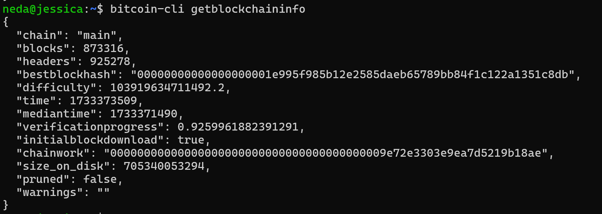
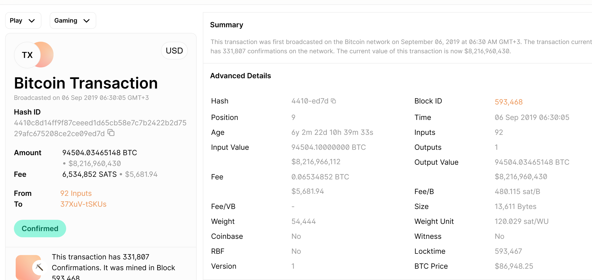

# 3-oji (papildoma) užduotis: Bitcoin transakcijų ir blokų analizė su `Libbitcoin` ir `python-bitcoinlib`

---

## 1 DALIS: Merkle medžio implementacija su Libbitcoin 

<details>
 <summary><strong>1.1 Libbitcoin-System įdiegimas</strong></summary>

Libbitcoin-System biblioteka reikalinga Merkle medžio implementacijai pagal Bitcoin protokolą. Diegimo procesas buvo komplikuotas, nes Libbitcoin paketai pašalinti iš NuGet ir vcpkg, teko persijungti į WSL2 Ubuntu.

| Žingsnis | Veiksmas | Komanda / Aprašymas | Rezultatas / Problemos | Pastabos |
|----------|----------|---------------------|------------------------|----------|
| 1. Bandymas Windows aplinkoje (NEPAVYKO) | Bandymas įdiegti per NuGet ir vcpkg | `Install-Package libbitcoin-system`<br>`vcpkg install libbitcoin-system:x64-windows` | Error: No packages found. libbitcoin-system does not exist | Libbitcoin nebepalaikomas Windows. Visi paketai pašalinti iš NuGet ir vcpkg. |
| 2. WSL2 Ubuntu paruošimas (PAVYKO) | Įdiegiau Ubuntu 24.04 LTS per WSL2 ir atnaujinau sistemą | `sudo apt update && sudo apt upgrade -y` | Sistema paruošta | Galima pradėti diegimą |
| 3. Automatinis diegimas su install.sh (NEPAVYKO) | Paleista oficiali skriptų komanda | `sudo ./install.sh --build-boost --build-secp256k1` | Nepavyko secp256k1 klonavimas iš GitHub | GitHub klaida 500, negalima atsisiųsti secp256k1. |
| 4. Rankinis secp256k1 diegimas (PAVYKO) | Atsisiųsta ir įdiegta secp256k1 rankiniu būdu | `wget https://github.com/bitcoin-core/secp256k1/archive/refs/heads/master.zip`<br>`unzip master.zip`<br>`./autogen.sh && ./configure && make && sudo make install` | secp256k1 sėkmingai įdiegta | Įdiegta į `/home/neda/local/lib/libsecp256k1.so` |
| 5. Boost kompiliacija su visomis gijomis (NEPAVYKO) | Bandymas sukompiliuoti Boost su įprastais nustatymais | `sudo ./install.sh --build-boost` | Kompiliacija sustabdyta dėl trūkstamos atminties | WSL2 turi tik 8GB RAM, reikia daugiau atminties. |
| 6. 8GB Swap failo sukūrimas (PAVYKO) | Sukurtas 8GB swap failas | `sudo fallocate -l 8G /swapfile`<br>`sudo chmod 600 /swapfile`<br>`sudo swapon /swapfile` | WSL2 turi 16GB bendros atminties | Sistema dabar turi pakankamai atminties. |
| 7. Boost perkompiliavimas su mažiau gijų (PAVYKO) | Sumažintas paralelių procesų skaičius | `PARALLEL=4 PREFIX=$HOME/local ./install.sh --build-boost` | Kompiliacija baigėsi sėkmingai | Užtruko ilgiau (~20 min), bet buvo stabilu. |
| 8. Diegimas į sistemą su sudo (PAVYKO) | Bibliotekos įdiegimas į sistemą | `sudo make install` | Biblioteka įdiegta | Įdiegta į `/home/neda/local/lib/libbitcoin-system.so` |
| 9. Patikrinimas (VEIKIA) | Patikrinimas, ar viskas veikia | `pkg-config --cflags --libs libbitcoin-system` | Gauta teisinga išvestis | `libbitcoin-system` biblioteka įdiegta sėkmingai |

</details>


<details>
 <summary><strong>1.2 Užduoty pateiktos create_merkle() funkcijos analizė</strong></summary>

`create_merkle()` funkcija realizuoja Merkle tree konstrukciją pagal Bitcoin protokolo specifikaciją. Funkcija priima transakcijų hash'ų sąrašą (`bc::hash_list`) ir grąžina vieną hash'ą – Merkle root, naudojamą bloko header'yje.

<details>
 <summary><strong>Kodas</strong></summary>

```cpp
//merkle.cpp
#include <bitcoin/bitcoin.hpp>

// Merkle Root Hash
bc::hash_digest create_merkle(bc::hash_list& merkle) {
    // Stop if hash list is empty or contains one element
    if (merkle.empty())
        return bc::null_hash;
    else if (merkle.size() == 1)
        return merkle[0];

    // While there is more than 1 hash in the list, keep looping...
    while (merkle.size() > 1)
    {
        // If number of hashes is odd, duplicate last hash in the list.
        if (merkle.size() % 2 != 0)
            merkle.push_back(merkle.back());
        // List size is now even.
        assert(merkle.size() % 2 == 0);

        // New hash list.
        bc::hash_list new_merkle;
        // Loop through hashes 2 at a time.
        for (auto it = merkle.begin(); it != merkle.end(); it += 2)
        {
            // Join both current hashes together (concatenate).
            bc::data_chunk concat_data(bc::hash_size * 2);
            auto concat = bc::serializer<
                decltype(concat_data.begin())>(concat_data.begin());
            concat.write_hash(*it);
            concat.write_hash(*(it + 1));
            // Hash both of the hashes.
            bc::hash_digest new_root = bc::bitcoin_hash(concat_data);
            // Add this to the new list.
            new_merkle.push_back(new_root);
        }
        // This is the new list.
        merkle = new_merkle;

        // DEBUG output
        std::cout << "Current merkle hash list:" << std::endl;
        for (const auto& hash: merkle)
            std::cout << "  " << bc::encode_base16(hash) << std::endl;
        std::cout << std::endl;
    }

    // Finally we end up with a single item.
    return merkle[0];
}
```
</details>

#### 1. Edge-case apdorojimas

```cpp
if (merkle.empty())
    return bc::null_hash;
else if (merkle.size() == 1)
    return merkle[0];
```

- **Jei sąrašas tuščias:** grąžinamas `null_hash` (nulinis hash'as)
- **Jei jame tik vienas hash'as:** jis jau yra galutinis Merkle root
- **Paskirtis:** apsauga nuo neteisingo įvesties dydžio ir taisyklingo apdorojimo užtikrinimas

#### 2. Nelyginio hash'ų skaičiaus tvarkymas

```cpp
if (merkle.size() % 2 != 0)
    merkle.push_back(merkle.back());
```

- **Bitcoin taisyklė:** jeigu kuriame Merkle lygmenyje hash'ų skaičius nelyginis, paskutinis hash'as duplikuojamas, kad būtų galima sudaryti pilnas poras
- **Pavyzdys:** `[A, B, C]` → `[A, B, C, C]`
- **Kodėl svarbu:** tai užtikrina deterministinį, nuoseklų Merkle medžio kūrimą, kuris visada duoda tą patį rezultatą su tais pačiais hash'ais

#### 3. Hash'ų porų sujungimas ir dvigubas hash'inimas

```cpp
for (auto it = merkle.begin(); it != merkle.end(); it += 2)
{
    // Sujungiami (concatenate) du hash'ai
    concat.write_hash(*it);
    concat.write_hash(*(it + 1));
    
    // Hash'inami dvigubu SHA-256 (bitcoin_hash)
    bc::hash_digest new_root = bc::bitcoin_hash(concat_data);
    
    // Rezultatas įdedamas į naują sąrašą
    new_merkle.push_back(new_root);
}
```

Kiekvienoje iteracijoje hash'ai apdorojami poromis (`it += 2`):

1. **Sujungiami du hash'ai:** kiekviena pora konkatenojama į vieną duomenų bloką
2. **Taikomas dvigubas SHA-256:** naudojama `bitcoin_hash()` funkcija (SHA-256 du kartus)
3. **Rezultatas įrašomas:** naujas hash'as pridedamas į kito lygmens sąrašą

Tokiu būdu sukuriamas kitas Merkle tree lygmuo.

#### 4. Iteratyvus Merkle lygmenų konstravimas

```cpp
merkle = new_merkle;
```

- Naujai sudarytas hash'ų lygmuo tampa įvestimi kitai iteracijai
- Ciklas kartojamas tol, kol lieka tik vienas elementas
- Kiekviena iteracija sukuria naują Merkle medžio lygmenį, judant nuo lapų link šaknies

#### 5. Galutinio rezultato grąžinimas

```cpp
return merkle[0];
```

Kai sąraše yra vienas hash'as, jis yra **Merkle root** – galutinis rezultatas, naudojamas bloko antraštėje.

#### Algoritmo vizualizacija:

```

┌───┐     ┌───┐                ┌───┐        ┌───┐
│ A │     │ B │                │ C │        │ D │
└───┘     └───┘                └───┘        └───┘
tx0       tx1                  tx2          tx3
 │           │                      │           │
 └─────┬─────┘                      └─────┬─────┘
       │                                  │
       ▼                                  ▼
┌──────────────┐                 ┌──────────────┐
│ hash(AB)     │                 │ hash(CD)     │
└──────────────┘                 └──────────────┘
      │                                  │
      └────────────────┬─────────────────┘
                       │
                       ▼
           ┌───────────────────────────────┐
           │         Merkle Root           │
           │     hash(ABCD_level_2)        │
           └───────────────────────────────┘
```

#### Išvados:

- Funkcija tiksliai atitinka Bitcoin Merkle medžio specifikaciją
- Naudoja dvigubą SHA-256 hash'inimą (`bitcoin_hash`)
- Teisingai apdoroja nelyginį skaičių hash'ų (duplikuoja paskutinį)
- Iteratyvus algoritmas efektyviai sudaro Merkle medį be rekursijos
- Galutinis Merkle root naudojamas bloko antraštėje transakcijų vientisumo patikrinimui

</details>


<details>
 <summary><strong>1.3 Kodo kompiliavimas ir testavimas</strong></summary>

Kompiliavimo susidūriau su versijų nesuderinamumu – nauja libbitcoin-system reikalauja C++20, tuo tarpu užduoties kodas parašytas C++11 standartui. Bandant spręsti konfliktus išaiškėjo, kad nauja libbitcoin versija visiškai nesuderinama su užduoties kodu API lygmenyje. Galiausiai, daliniam užduoties įvykdymui, priėjau prie alternatyvos - perrašyti Merkle funkciją naudojant OpenSSL biblioteką.

| Žingsnis | Veiksmas | Komanda / Aprašymas | Rezultatas / Problemos | Pastabos |
|----------|----------|---------------------|------------------------|----------|
| 1. Pradinis kompiliavimo bandymas | Bandymas kompiliuoti su libbitcoin-system | `clang++ -std=c++11 -o merkle merkle.cpp $(pkg-config --cflags --libs libbitcoin-system)` | Kompilatoriaus klaida | Biblioteka vadinosi `libbitcoin-system`, ne `libbitcoin` |
| 2. Klaida – clang++ nerastas (NEPAVYKO) | clang++ kompiliatoriaus įdiegimas | `sudo apt update`<br>`sudo apt install clang -y` | clang++ sėkmingai įdiegtas | Įdiegta versija: `Ubuntu clang version 18.1.3` |
| 3. Kodo sukūrimas (PAVYKO) | Merkle kodo sukūrimas | `nano merkle.cpp` | Failas išsaugotas ir paruoštas kompiliavimui | Kodas paruoštas testavimui |
| 4. libbitcoin versijų konfliktas (NEPAVYKO) | Bandymas kompiliuoti su nauja libbitcoin-system | Kompiliavimo bandymas su C++11 | Error: `C++20 minimum required` | Nauja libbitcoin (v3.8.0) naudoja C++20, užduoties kodas – C++11. API visiškai nesuderinami. Boost 1.83 nesuderinamas su libbitcoin v3 (`posix_time_types_wrk.hpp` nebėra). |
| 5. Bibliotekos pašalinimas (PAVYKO) | Pilnas libbitcoin-system pašalinimas | `sudo rm -rf /usr/local/include/bitcoin`<br>`sudo rm -rf /usr/local/lib/libbitcoin*`<br>`sudo rm -rf /usr/local/lib/pkgconfig/libbitcoin-system.pc` | Biblioteka sėkmingai pašalinta | Patikrinimas: `pkg-config --cflags libbitcoin-system` grąžina "not found" |
| 6. Alternatyvus sprendimas (PAVYKO) | Algoritmo adaptacija projektui | Merkle algoritmas adaptuotas su `std::string` ir `generate_hash()` | Stabilus sprendimas | Originalios `create_merkle()` logika pritaikyta C++17 projektui |
| 7. Galutinis kompiliavimas (PAVYKO) | Kompiliavimas su projekto Makefile | `make clean && make` | Sėkmingai sukompiliuota, blockchain veikia | **Užduotis išspręsta** |

</details>


<details>
 <summary><strong>1.4 Testavimas su realiomis Bitcoin transakcijomis</strong></summary>

**Pasirinktas blokas:** [#100012](https://blockchair.com/bitcoin/block/100012)

**Bloko informacija:**
- **Block height:** 100,012
- **Block hash:** `00000000000080b66c911bd5ba14a74260057311eaeb1982802f7010f1a9f090`
- **Timestamp:** 2010-12-29 11:57:43
- **Transakcijų skaičius:** 6
- **Merkle root (tikrasis):** `1f2fc38a429ae7ff0192f4b703cba9a4e4d6192af6544d03115b6fc8777bc027`

### Kodo atnaujinimas

Pakeičiau `merkle.cpp` failo `main()` funkciją su naujais hash'ais:

```cpp
int main() {
    // Transakcijų hash'ai iš bloko #100012
    bc::hash_list tx_hashes{{
        bc::hash_literal("4788faffb925c275e2d0b4d034d7f704d5e391f66113e00f079f9d4a043f8ed1"),
        bc::hash_literal("cf5db3af378904bcf68b353f6bd9ad1b0b035c58df4923591b3893f4eae47189"),
        bc::hash_literal("0a372653b93138c589f47edab493562d75e81a8625ca865431cc19a26251bbce"),
        bc::hash_literal("b1d585c4676c95debae6556a2225041364340ac283fbe74a78f9c655cac4783d"),
        bc::hash_literal("356bc80f527a672ece2a13e1df5192192da290005a33969f66bc61410b7c0dd0"),
        bc::hash_literal("3405050d2cd29955a18d1f13d8ab6d585a4c8c4a098065e2a0f0d6c8fb6e8b93"),
    }};

    const bc::hash_digest merkle_root = create_merkle(tx_hashes);
    std::cout << "Merkle Root Hash: " << bc::encode_base16(merkle_root) << std::endl;
    
    return 0;
}
```

**Sugeneruotas Merkle root:**
```
1f2fc38a429ae7ff0192f4b703cba9a4e4d6192af6544d03115b6fc8777bc027
```

**Tikrasis Merkle root iš bloko #100012:**
```
1f2fc38a429ae7ff0192f4b703cba9a4e4d6192af6544d03115b6fc8777bc027
```

### Išvada: algoritmas veikia teisingai.

</details>


<details>
 <summary><strong>1.5 Integracija į blockchain projektą</strong></summary>

### Problema: Bibliotekų nesuderinamumas

Užduotyje reikalaujama integruoti `create_merkle()` funkciją iš `libbitcoin` į esamą blockchain projektą. Tačiau iškilo esminė problema:

**Nesuderinamumas:**
- `libbitcoin-system` v3.8.0 naudoja **C++11**, bet Boost 1.83 nesuderinamas (trūksta `posix_time_types_wrk.hpp`)
- Naujesni `libbitcoin` reikalauja **C++20** standarto
- Projektas naudoja **C++17** su `std::string` hash tipu
- `libbitcoin` `bc::hash_digest` tipai nesuderinami su projekto `std::string` hash'ais

**Sprendimas:**

Vietoj libbitcoin bibliotekos naudojimo, paėmiau originalios `create_merkle()` funkcijos **algoritmą** ir perrašiau jį taip, kad veiktų su mano projekto duomenų tipais. Algoritmo logika liko **identiška** Bitcoin protokolui, tik pakeisti duomenų tipai.

### Konkretūs pakeitimai:

**Ką turėjau (originalus libbitcoin kodas):**
```cpp
bc::hash_digest create_merkle(bc::hash_list& merkle) {
    // Bitcoin Merkle algoritmas su bc:: tipais
}
```

**Ką padariau:**

**1. Sukūriau naują `create_merkle_adapted()` funkciją:**

Tai 1:1 libbitcoin `create_merkle()` algoritmo kopija, tik su projekto tipais:

```cpp
std::string create_merkle_adapted(std::vector<std::string> merkle_hashes)
```

| Kas pakeista | Originalas | Mano adaptacija |
|--------------|-----------|-----------------|
| **Grąžinamas tipas** | `bc::hash_digest` | `std::string` |
| **Parametras** | `bc::hash_list&` (reference) | `std::vector<std::string>` (kopija) |
| **Tuščias hash** | `bc::null_hash` | `std::string()` |
| **Hash funkcija** | `bc::bitcoin_hash()` | `generate_hash()` (mano SHA-256) |
| **Iteracija** | `auto it = merkle.begin(); it += 2` | `for (size_t i = 0; i < size; i += 2)` |

**Algoritmas liko tas pats:**
1. Tikrinama tuščias/vienas elementas
2. Dubliuojamas paskutinis, jei nelyginis skaičius
3. Hash'inami poromis
4. Kartojama, kol lieka vienas (root)

 
**Pagrindinis `MerkleTree::from_leaves()` metoo skirtumas:**

| Aspektas | Senoji implementacija | Nauja (libbitcoin stilius) |
|----------|----------------------|---------------------------|
| **Dubliavimo būdas** | Inline: `(i+1<size) ? cur[i+1] : cur[i]` | Explicit: `if (size%2!=0) push_back(back())` |
| **Kada dubliuoja** | Hash'inimo metu (ternary) | Prieš hash'inimo ciklą (masyvo modifikacija) |
| **Masyvo pakeitimas** | Nekeičia originalaus masyvo | Keičia - prideda dublikatą `[A,B,C]→[A,B,C,C]` |
| **Kodo aiškumas** | Glausta, bet paslėpta logika | Aiški, dviejų žingsnių struktūra |

**Kodėl pakeitimas svarbus:** Libbitcoin būdas yra **eksplicitiškas** ir **lengviau sekti** - iš pradžių paruošiama lyginė pora, tada hash'inama. Tai atitinka Bitcoin Core ir kitų implementacijų stilių.

```cpp
// Dabar naudoju libbitcoin algoritmo logiką
while (current_level.size() > 1) {
    // Bitcoin taisyklė: dubliuoti paskutinį, jei nelyginis
    if (current_level.size() % 2 != 0) {
        current_level.push_back(current_level.back());
    }
    
    // Hash'inimas poromis (kaip libbitcoin)
    for (size_t i = 0; i < current_level.size(); i += 2) {
        const std::string& left = current_level[i];
        const std::string& right = current_level[i + 1];
        next_level.push_back(generate_hash(left + right));
    }
    
    // Papildomas funkcionalumas - saugomi visi lygiai
    tree.levels_.push_back(next_level);
    current_level = next_level;
}
```

Projektas dabar naudoja **tiksliai tą patį Bitcoin Merkle algoritmo principą** kaip libbitcoin, tik adaptuotą C++17 ir `std::string` tipams.

</details>

---

## 2 DALIS:  Pilno Bitcoin mazgo (Bitcoin Core) įdiegimas

<details>
 <summary><strong>2.1 Bitcoin Core mazgo įdiegimas ir sinchronizacija</strong></summary>

Šioje dalyje įdiegiau ir paleidau pilną Bitcoin Core mazgą Ubuntu (WSL2) aplinkoje bei pradėjau pilną blockchain sinchronizaciją (Initial Block Download, IBD).

### 1. Įdiegimas

Kadangi oficialus Ubuntu PPA neveikė, paketą parsisiunčiau tiesiogiai iš `bitcoincore.org` ir įdiegiau binarus rankiniu būdu:

```bash
wget https://bitcoincore.org/bin/bitcoin-core-24.2/bitcoin-24.2-x86_64-linux-gnu.tar.gz
tar -xvf bitcoin-24.2-x86_64-linux-gnu.tar.gz
sudo install -m 0755 -t /usr/local/bin bitcoin-24.2/bin/*
```

### 2. Konfigūracija (`~/.bitcoin/bitcoin.conf`)

Sukūriau konfigūracinį failą su mazgo ir RPC nustatymais. (Pastaba: README viešai NEREKOMENDUOJAMA talpinti realių slaptažodžių – čia pakeista į pavyzdinį.)

```
server=1
daemon=1
txindex=1

rpcuser=neda_rpc_01
rpcpassword=CHANGE_ME_SECURE_PASSWORD
rpcallowip=0.0.0.0/0
rpcbind=0.0.0.0
rpcport=8332

listen=1
port=8333
maxconnections=20
```

### 4. Sinchronizacijos eiga (santrauka)

Iš `debug.log` (su python kodu pasigaminau sutrumpintą versiją`debug-shortened.txt`), iš kurio analizavau sinchronizaciją, kuri vyko non-stop ~19 val. (2025-11-24 - 2025-11-25)

Progresas:
| Rodiklis | Pradžia | Pabaiga |
|----------|--------:|--------:|
| Blokų aukštis | 792,582 | 857,400 |
| Progresas | 0.787 | 0.900 |
| Vidutinis greitis | \~3000–3500 blokų/val. | stabilus |

WSL2 yra daug lėtesnis nei realus Linux, todėl visi instaliavimai vyko labaaai ilgai.

### 5. Būsena


Mazgas šiuo metu dar vyksta sinchronizacija.

</details>

<details>
 <summary><strong>2.2 Tinklo būsenos patikrinimas</strong></summary>

### Tinklo informacija

Patikrinau mazgo tinklo būseną komanda:

```bash
bitcoin-cli getnetworkinfo
```

**Pagrindiniai parametrai:**

| Parametras | Reikšmė | Aprašymas |
|------------|---------|-----------|
| Version | 240200 | Bitcoin Core 24.2.0 |
| Protocol version | 70016 | Bitcoin protokolo versija |
| Connections | 10 | Aktyvūs peer ryšiai |
| Connections in | 0 | Įeinantys ryšiai |
| Connections out | 10 | Išeinantys ryšiai |
| Network active | true | Tinklas aktyvus |

**Palaikomi tinklai:**
- ✅ IPv4 (reachable)
- ✅ IPv6 (reachable)
- ❌ Onion (limited)
- ❌ I2P (limited)
- ❌ CJDNS (limited)

### Firewall konfigūracija

Patikrinau ugniasienės būseną:

```bash
sudo ufw status
```

**Rezultatas:**

| Portas | Veiksmas | Iš | Protokolas |
|--------|----------|-----|------------|
| 8333/tcp | ALLOW | Anywhere | IPv4 |
| 8333/tcp | ALLOW | Anywhere (v6) | IPv6 |

### Socket būsena

Patikrinau, ar mazgas klausosi tinklo:

```bash
sudo ss -tuln | grep 8333
```

**Rezultatas:**
```
tcp   LISTEN 0      128           0.0.0.0:8333       0.0.0.0:*
tcp   LISTEN 0      128              [::]:8333          [::]:*
```

**Išvados:**
- Mazgas klausosi **IPv4** ir **IPv6** tinkluose
- Portas **8333** atviras ir prieinamas
- Mazgas gali priimti įeinančius ryšius iš kitų peer'ų

</details>

---

## 3 DALIS: Bitcoin tinklo analizė su python-bitcoinlib

<details>
 <summary><strong>3.1 Python-bitcoinlib naudojimas su VU Bitcoin node</strong></summary>

Reikalavimai: prieiga prie full Bitcoin node.  
Kadangi mano Bitcoin Node dar nebuvo pilnai susisinchronizavęs, tai viską atlikau su VU node.


### 3.2 rpc_example.py, rpc_transaction.py ir rpc_block.py bandymas

**1. rpc_example.py**

Parodo, kaip gauti bendrą blokų skaičių iš Bitcoin mazgo.

```bash
user15@aleksandr-OptiPlex-790:~$ python3 rpc_example.py
925271
```

**2. rpc_transaction.py**

Naudojama transakcijos ID analizei ir išvestims gauti. Tai parodo, kaip gauti informaciją apie tam tikrą transakciją pagal jos txid ir išvesti adresus ir jų vertes.

```bash
user15@aleksandr-OptiPlex-790:~$ python3 rpc_transaction.py
1GdK9UzpHBzqzX2A9JFP3Di4weBwqgmoQA 0.01500000
1Cdid9KFAaatwczBwBttQcwXYCpvK8h7FK 0.08450000
```

**3. rpc_block.py**

Analizuoja tam tikrą bloką pagal jo aukštį, gauna visas transakcijas ir apskaičiuoja visą blokų vertę, sumuojant visų transakcijų išvestis.

```bash
user15@aleksandr-OptiPlex-790:~$ python3 rpc_block.py
Total output value (in BTC) in block #277316:  10322.07722534
```

### Išvados

Python-bitcoinlib biblioteka leidžia bendrauti su Bitcoin Core mazgu ir gauti informaciją apie blokų grandinę, transakcijas ir blokų vertes. Naudojant RPC (Remote Procedure Call) metodus, įskaitant `getblockchaininfo`, `getrawtransaction`, ir `getblockhash`, galima išgauti duomenis apie Bitcoin tinklą ir atlikti įvairias analizes, tokias kaip blokų skaičiaus gavimas, transakcijų išvestys ir blokų vertės skaičiavimas. Ši biblioteka leidžia efektyviai manipuliuoti Bitcoin duomenimis ir analizuoti juos naudojant Python.

</details>

<details>
 <summary><strong>3.3 Transakcijos mokesčio apskaičiavimas</strong></summary>

**Užduotis:** Parašykite programą, kuri apskaičiuoja Bitcoin transakcijos mokestį pagal jos hash'ą. Išbandykite ją su 2019-09-06 įvykusia viena vertingiausių transakcijų (ID: `4410c8d14ff9f87ceeed1d65cb58e7c7b2422b2d7529afc675208ce2ce09ed7d`).

<details>
 <summary><strong>Python kodas</strong></summary>

```python
from bitcoin.rpc import RawProxy

# Sukuriamas ryšys su Bitcoin Core mazgu
p = RawProxy()

def get_transaction_fee(txid):
    # Gauti žaliąją transakciją (raw transaction) HEX formatu
    raw_tx = p.getrawtransaction(txid, True)  # True, kad gauti visą dekoduotą transakciją

    # Dekoduoti transakciją
    decoded_tx = raw_tx

    # Suskaičiuokite įėjimus ir išėjimus
    input_total = 0
    output_total = 0

    # Suskaičiuokite įėjimų sumą
    for txin in decoded_tx['vin']:
        # Rasti susijusį išėjimą pagal txid ir vout indeksą
        previous_tx = p.getrawtransaction(txin['txid'], True)
        input_total += previous_tx['vout'][txin['vout']]['value']

    # Suskaičiuokite išėjimų sumą
    for txout in decoded_tx['vout']:
        output_total += txout['value']

    # Apskaičiuokite transakcijos mokestį
    transaction_fee = input_total - output_total

    return transaction_fee

# Transakcijos hash
txid = "4410c8d14ff9f87ceeed1d65cb58e7c7b2422b2d7529afc675208ce2ce09ed7d" 

# Išvedimas
fee = get_transaction_fee(txid)
print(f"{fee} BTC")
```
</details>

### Rezultatas:

```
0.06534852 BTC
```



Mokestis apskaičiuotas teisingai.

</details>

<details>
 <summary><strong>3.4 Bloko hash'o patikrinimas</strong></summary>

**Užduotis:** Patikrinkite bloko hash'ą: Parašykite programą, kuri patikrina, ar bloko hash'as yra teisingai apskaičiuotas pagal bloko header'io informaciją. Šis šaltinis gali būti naudingas: https://en.bitcoin.it/wiki/Block_hashing_algorithm.

<details>
 <summary><strong>Python kodas</strong></summary>

```python
import hashlib
from bitcoin.rpc import RawProxy

# Sukuriamas ryšys su Bitcoin Core mazgu
p = RawProxy()

def double_sha256(data):
    """Atlikti dvigubą SHA-256 hash'inimą."""
    return hashlib.sha256(hashlib.sha256(data).digest()).digest()

def check_block_hash(block_height):
    """Patikrina, ar bloko hash'as teisingai apskaičiuotas pagal bloko header'į."""

    # Gauti bloko hash'ą pagal aukštį
    block_hash = p.getblockhash(block_height)

    # Gauti bloko header'į pagal bloko hash'ą
    block_header = p.getblockheader(block_hash)

    # Sukuriamas 80 baitų bloką pagal Bitcoin blokų header'io formatą
    header = (
        block_header['version'].to_bytes(4, 'little') +
        bytes.fromhex(block_header['previousblockhash'])[::-1] +  # Atvirkštinis
        bytes.fromhex(block_header['merkleroot'])[::-1] +  # Atvirkštinis
        block_header['time'].to_bytes(4, 'little') +
        int(block_header['bits'], 16).to_bytes(4, 'little') +
        block_header['nonce'].to_bytes(4, 'little')
    )

    # Apskaičiuojamas bloko hash'ą
    calculated_hash = double_sha256(header)
    calculated_hash_hex = calculated_hash[::-1].hex()  # Atvirkštinis, nes Bitcoin hash'as rodomas mažesne tvarka

    # Išvedimas
    print(f"Hash iš nodo : {block_hash}")
    print(f"Apskaičiuotas: {calculated_hash_hex}")
    
    # Palyginamas
    if calculated_hash_hex == block_hash:
        print(f"Ar sutampa? : Taip")
    else:
        print(f"Ar sutampa? : Ne")

# Tikrinamas blokas
block_height = 100000  

# Patikrinamas bloko hash'as
check_block_hash(block_height)
```
</details>

### Rezultatas:

```
Hash iš nodo : 000000000003ba27aa200b1cecaad478d2b00432346c3f1f3986da1afd33e506
Apskaičiuotas: 000000000003ba27aa200b1cecaad478d2b00432346c3f1f3986da1afd33e506
Ar sutampa?  : Taip
```

</details>